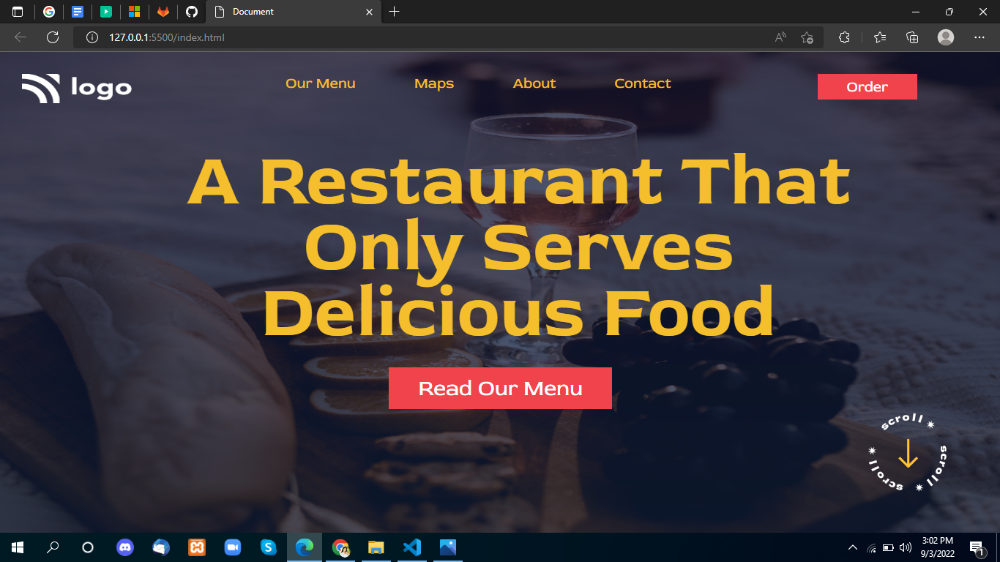

# Project-2

 

## Project live link
[https://my-project-02.netlify.app/](https://my-project-02.netlify.app/ "project02")

## Screenshot

 

## project Type
- UI Design
- One Page Website

## My learning from this Project
- Background Position
- How to design HTML Code
- linear-gradient Effect
- Image Fix

## Time to make this project
#### Approx 2 hour to make this project
